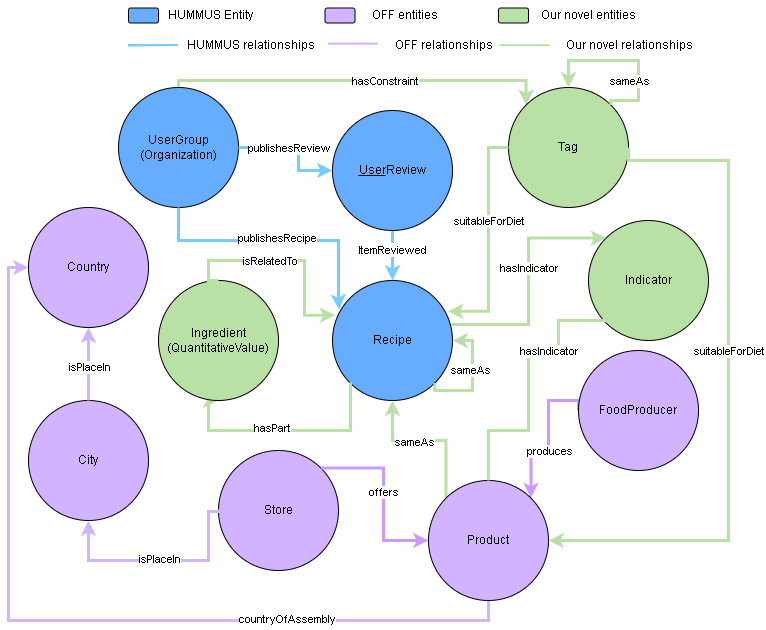
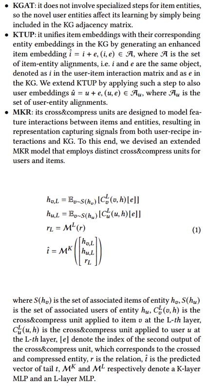

# FoodNexus

This the official *FoodNexus* repository, developed as part of an applied research initiative in knowledge representation, semantic technologies, and food informatics.

## 📘 Overview



**FoodNexus** aims to:

* Develop one of the most comprehensive food-related ontologies currently available.
* Investigate novel methodologies for **entity linking** and **user attribute extraction** leveraging Large Language Models (LLMs).
* Integrate heterogeneous food knowledge bases (e.g., *OpenFoodFacts*, *HUMMUS*) into a coherent semantic framework.

This project explores the intersection of ontology engineering, natural language processing, and user modeling in the food domain.


To provide context on the comprehensiveness of our FoodNexus dataset compared to other food datasets focused on recommendation, we present the following comparison table:

| Dataset          | Nutrients | Healthiness | Origin Country | Sustainability | Packaging | Interactions | User Attributes |
|------------------|-----------|-------------|----------------|----------------|-----------|--------------|-----------------|
| FoodOn           | ✗         | ✗*          | ✓              | ✗              | ✓         | ✗            | ✗               |
| FoodKG           | ✓         | ✗           | ✗              | ✗              | ✗         | ✗            | ✗               |
| HUMMUS           | ✓         | ✓           | ✗              | ✗              | ✗         | ✓            | ✗               |
| OFF              | ✓         | ✓           | ✓              | ✓              | ✓         | ✗            | ✗               |
| **FoodNexus (Ours)** | ✓         | ✓           | ✓              | ✓              | ✓         | ✓            | ✓               |

*✓: data type available, ✗: data type not available or not applicable, *: only categorical data like allergens*

This table highlights how FoodNexus aims to integrate a broader range of attributes, including user-related ones, which are crucial for personalized recommendation systems and in-depth analyses.

---

## 📦 Installation and Usage

### 1. Requirements

Install Ollama for host the LLM.

Ensure you are using **Python ≥ 3.8**. Then install the dependencies:

```bash
pip install -r requirements.txt
```

### 2. Data Dependencies

To run the scripts successfully, the following external resources are required:

* **HUMMUS**: Preprocessed CSV files (from the `data preprocess` folder in the [HUMMUS repository](https://gitlab.com/felix134/connected-recipe-data-set/-/tree/master/data/hummus_data/preprocessed?ref_type=heads))
* **OFF Ontology**: The OpenFoodFacts ontology, available from the [OFF Wiki](https://world.openfoodfacts.org/data) in csv format.

Place these files in a new folder named `csv_file` at the root of this repository.


### 3. Execution Workflow

This workflow outlines the steps to reproduce the FoodNexus ontology, from initial data setup to the final merged knowledge graph. Ensure you have completed the steps in "1. Requirements" and "2. Data Dependencies" before proceeding.

1.  **Initial Data Setup:**
    *   Download the required datasets (HUMMUS preprocessed CSVs, OpenFoodFacts CSV) from their official sources, as detailed in the "Data Dependencies" section.
    *   Place all downloaded CSV files into the `csv_file/` directory at the root of this repository.

2.  **Environment and LLM Setup:**
    *   Ensure you have created a Python virtual environment (e.g., using `venv` or `conda`) and installed all dependencies by running `pip install -r requirements.txt` within that environment.
    *   Download and install [Ollama](https://ollama.com/) if you intend to run Large Language Models (LLMs) locally. Follow the official Ollama installation guide.
    *   Create the necessary local LLM models (if using Ollama) by executing the `llm_creation.py` script or the associated Jupyter notebook located in the `analisys_and_file_creation_file/` directory. This step configures the specific LLMs used for inference tasks.

3.  **Core Data Processing and File Generation:**
    *   Execute the `file_creation_jupyter.ipynb` notebook, located in the `analisys_and_file_creation_file/` directory, to perform initial data processing and generate intermediate needed files.

4.  **Dataset Normalization:**
    *   Run the normalization scripts to standardize recipe data from different sources:
        *   `python normalization_pipeline_file/normalize_hummus.py`
        *   `python normalization_pipeline_file/off_normalize.py`

        These scripts will produce normalized recipe datasets.


5.  **LLM-based Information Inference:**
    *   Execute the following scripts to infer additional information (e.g., user attributes, enhanced descriptions) using the configured LLMs:
        *   `python attribute_extraction_file/infere_info_from_description.py`
        *   `python attribute_extraction_file/infere_info_from_review.py`

6.  **Entity Linking Preparation and Execution:**
    *   **Recipe List Generation:** Execute the *last cell* in the `entity_linking_jupyter.ipynb` notebook, found within the `entity_linking_file/` directory. This step creates a consolidated list of recipes from all datasets, essential for the subsequent BERT-based merging process.
    *   **Embedding Creation:** Generate embeddings for recipe names, which are crucial for similarity-based linking. Execute the following scripts:
        *   `python entity_linking_file/create_embedding_foodkg.py`
        *   `python entity_linking_file/create_embedding_hummus.py`
        *   `python entity_linking_file/create_embedding_off.py`
    *   **Linking Execution:** Perform the entity linking between datasets by running:
        *   `python entity_linking_file/link_off_hum.py`
        *   `python entity_linking_file/link_off_foodkg.py`
        *   `python entity_linking_file/link_hum_hum.py` 
    *   **Threshold Filtering:** Use the `filter_association_by_threshold.ipynb` notebook in `entity_linking_file/`. This allows you to refine the linking results (e.g., by setting a similarity threshold of 0.975). The default value for the threshold is 0.975 for make the resource slimmer and more robust but all value over 0.85 give significative relation.

7.  **RDF Graph Generation:**
    *   Convert the processed and linked data into RDF triples. Execute the following scripts, founded in the `create_rdf_file/` directory:
        *   `python create_rdf_file/hummus_to_rdf_not_infered.py`
        *   `python create_rdf_file/hummus_to_rdf.py`
        *   `python create_rdf_file/merge_hum_hum_ontology_to_rdf.py`
        *   `python create_rdf_file/merge_off_fkg_ontology_to_rdf.py`
        *   `python create_rdf_file/merge_off_hum_ontology_to_rdf.py`
        *   `python create_rdf_file/off_to_rdf.py`

8.  **Final Ontology Merging:**
    *   Execute the `merge_ontology.py` script located in the root directory to combine all generated RDF graphs into the final, unified **FoodNexus** ontology.

## 📂 Repository Structure

```
FoodNexus/
├── analisys_and_file_creation_file/  # Scripts and notebooks for data analysis and RDF prep
├── attribute_extraction_file/        # Attribute extraction logic from user
├── config_file/                      # Configuration for preprocessing and unit normalization
├── create_rdf_file/                  # Scripts to generate RDF triples from processed data
├── csv_file/                         # All the non-script file
├── entity_linking_file/              # Scripts for entity linking and embedding generation
├── extra_script_for_hopwise/         # Script to analyze the dataset to apply to the Hopwise repository
├── images/                           # Images used in the README file
├── llm_model_file/                   # Prompt templates for LLMs
├── normalization_pipeline_file/      # Pipeline for normalization of attributes and ingredients
├── ollama_server_file/               # File for using ollama for a long period of time
├── ontology_statistic/               # Ontology evaluation and statistics scripts
├── view_onthology_file/              # Visualization tools for ontologies
├── main.py                           # Main script
├── merge_ontology.py                 # Main script for ontology merging
├── pipeline_jupyter.ipynb            # Notebook for calcolate cohen coefficient
├── requirements.txt                  # Python dependencies
└── README.md                         # Project documentation
```

## 🎯 Research Objectives

This project investigates:

* The effectiveness of LLMs for ontology population and schema alignment.
* Automated semantic enrichment from food-related databases.
* Personalized food knowledge graphs through user-driven attribute inference.

The outcomes are relevant for personalized nutrition, semantic search, and knowledge graph completion in the food domain.

# 📊 Result
We trained several recommendation models on the Hummus recipe dataset. Subsequently, we evaluated the quality of the recommended recipes by analyzing their nutritional statistics derived from Open Food Facts (OFF) data.

The following models were employed:

- **Pop**: is a non-personalized baseline that recommends items based on their overall popularity, serving as a lower bound for personalized recommendation systems.

- **BPR**: is a pairwise learning-to-rank framework that optimizes models such as matrix factorization for personalized ranking. It maximizes the prediction that observed interactions are ranked higher than unobserved ones, typically trained on implicit feedback using stochastic gradient descent.

- **NeuMF**: is a neural network-based model that combines generalized matrix factorization with a multi-layer perceptron to learn complex user-item interactions from implicit feedback, enabling non-linear collaborative filtering.

- **LightGCN**: simplifies graph convolutional collaborative filtering by removing feature transformation and nonlinear activation, relying solely on neighborhood aggregation to refine user and item embeddings across layers.

- **KGAT**: integrates knowledge graph semantics by extending graph attention networks, propagating relation-specific messages, and learning attention scores for each edge type. The model performs recommendation and KG embedding separately, aligning item representations through shared embeddings and dot product inference.

- **KTUP**: jointly optimizes recommendation and knowledge graph completion using translation-based embedding models. It represents user preferences as relation vectors in a translational framework (i.e., user + preference ≈ item), inspired by models such as TransE and TransH. The model simultaneously learns knowledge graph embeddings to enhance recommendation via shared latent representations.

- **MKR**: employs a multi-task learning framework where recommendation and KG embedding tasks learn shared latent features. Its core Cross\&compress units enable bi-directional knowledge transfer by modeling high-order feature interactions, primarily between items in the recommendation task and entities in the knowledge graph, adaptively learning cross-task relevance.

---

## Model Modifications for User Representation in Knowledge Graphs

For some models (specifically KGAT, KTUP, and MKR), custom variants were developed to explicitly incorporate users as entities within the knowledge graph. This allows user preferences and behaviors to be directly modeled alongside item and attribute information in the KG. The figure below illustrates the general approach to these modifications:




---

## Fine-Tuning and Filtering

Each model underwent a rigorous fine-tuning process. This involved a grid search methodology to identify the optimal set of hyperparameters. Additionally, a data filtering step was applied to remove users and items with a low number of interactions, with the specific interaction count thresholds also determined via grid search.

### Interaction Filtering Thresholds

The range of interaction count thresholds explored during grid search for filtering entities (users/items) was:
*   `user_inter_num_interval`: *[1, 2, 3, 4, 5, 7, 10, 15, 20, 25, 30]*
*   `item_inter_num_interval`: *[1, 2, 3, 4, 5, 7, 10, 15, 20, 25, 30]*

best param:
* user_inter_num_interval: "[5,inf)"
* item_inter_num_interval: "[5,inf)"

### Interaction Filtering Thresholds for triples

The range of interaction count thresholds explored during grid search for filtering triples was:
*   `entity_kg_num_interval`: *[1, 2, 3, 4, 5, 7, 10, 15, 20, 25, 30]*
*   `user_entity_kg_num_interval`: *[1, 2, 3, 4, 5, 7, 10, 15, 20, 25, 30]*

best param:
* kg_reverse_r: False
* entity_kg_num_interval: "[30,inf)"
* relation_kg_num_interval: "[1,inf)"
* user_entity_kg_num_interval: "[5,inf)"


### Hyperparameter Tuning Ranges

The hyperparameter ranges explored for each model during the grid search process were as follows:

- **BPR**:
    - `embedding_size`: `[32, 64, 128, 256]`
    - `learning_rate`: `[0.01, 0.001, 0.0001]`

best param:
embedding_size: 256
lerning_rate: 0.0001


- **EASE**:
    - `reg_weight`: `[1.0, 10.0, 100.0, 250.0, 500.0, 1000.0]`

best param:
embedding_size': 128
learning_rate: 0.01
n_layers: 2
reg_weight: 1e-05

- **LightGCN**:
    - `embedding_size`: `[64, 128]`
    - `learning_rate`: `[0.01, 0.001, 0.0001]`
    - `n_layers`: `[1, 2, 3]`
    - `reg_weight`: `[1e-05, 1e-03]`
best param:


- **NeuMF**:
    - `mf_embedding_size`: `[64, 128]`
    - `mlp_train`: `[True, False]`
    - `learning_rate`: `[0.01, 0.001, 0.0001]`
    - `dropout_prob`: `[0.0, 0.1]`
    - `mlp_hidden_size`: `['[64,32,16]', '[32,16,8]']`

best param:
mf_embedding_size: 64
mlp_train: False 
learning_rate: 0.001
dropout_prob: 0.0
mlp_hidden_size: [32,16,8]

- **KGAT**:
    - `embedding_size`: `[64, 128]`
    - `learning_rate`: `[0.01, 0.0001]`
    - `layers`: `['[64,32,16]', '[128,64,32]']`
    - `reg_weight`: `[1e-4, 1e-5]`
    - `mess_dropout`: `[0.1, 0.2]`

best param:
embedding_size: 128
layers: [64,32,16]
mess_dropout: 0.2
reg_weights: 0.0001
lerning_rate: 0.0001


- **KTUP**:
    - `embedding_size`: `[64, 128]`
    - `learning_rate`: `[0.01, 0.001, 0.0001]`
    - `L1_flag`: `[True, False]`
    - `use_st_gumbel`: `[True, False]`
    - `train_rec_step`: `[8, 10]`
    - `train_kg_step`: `[1, 2, 3]`

best param:
train_rec_step: 10
train_kg_step: 1
embedding_size: 128
use_st_gumbel: True
L1_flag: False
learning_rate: 0.001

- **MKR**:
    - `embedding_size`: `[64, 128]`
    - `learning_rate`: `[0.01, 0.001, 0.0001]`
    - `low_layers_num`: `[1, 2, 3]`
    - `high_layers_num`: `[1, 2]`
    - `l2_weight`: `[1e-6, 1e-4]`
    - `kg_embedding_size`: `[32, 64]`

best param:
embedding_size: 128
kg_embedding_size: 64
low_layers_num: 3
high_layers_num: 1
kge_interval: 3
learning_rate: 0.001
use_inner_product: True
reg_weight: 1e-06
dropout_prob: 0.0

---

The following visualizations display the distribution of key FoodNexus attributes (e.g., NOVA group, packaging, origin, nutrients) for recipes recommended by our models. This analysis was performed by retroactively enriching the HUMMUS-trained recommendations with FoodNexus metadata, allowing us to assess their semantic quality and identify potential biases.


**Key Observations from the Attribute Distributions:**

*   **Processing Level (NOVA Group):** Models generally exhibit a strong tendency to recommend ultra-processed foods (average NOVA scores often high, e.g., between 3.72-3.83). The Pop model, in particular, tends to recommend items with higher NOVA scores and more additives.
*   **Packaging:** A consistent preference for plastic packaging is observed across most models, suggesting potential biases in the training data or a lack of environmental considerations.
*   **Geographic Origin:** Recommended products are heavily concentrated on Europe and, to a lesser extent, the USA, indicating an underrepresentation of non-Western food systems.
*   **Common Allergens:** Gluten and milk are frequently present in recommended items, while others like soy or tree nuts are less common.
*   **Nutritional Patterns:** While varying, some interesting patterns emerge. For instance, the Pop model, despite higher processing indicators, sometimes showed lower cholesterol and added sugars. Notably, no model significantly increased added sugar content compared to the original dataset's distribution.


---

Model Performance:

| Model    | Precision@10 | Precision@20 | Precision@50 | Recall@10 | Recall@20 | Recall@50 | NDCG@10 | NDCG@20 | NDCG@50 | Hit@10 | Hit@20 | Hit@50 |
| :------- | :----------: | :----------: | :----------: | :--------: | :--------: | :--------: | :-------: | :-------: | :-------: | :------: | :------: | :------: |
| Pop      | 0.0004       | 0.0003       | 0.0002       | 0.0008     | 0.0010     | 0.0013     | 0.0008    | 0.0009    | 0.0009    | 0.0035   | 0.0050   | 0.0077   |
| BPR      | 0.0053       | 0.0047       | 0.0037       | 0.0136     | 0.0244     | 0.0467     | 0.0102    | 0.0133    | 0.0189    | 0.0474   | 0.0777   | 0.1361   |
| NeuMF    | 0.0062       | 0.0053       | 0.0040       | 0.0175     | 0.0276     | 0.0515     | 0.0131    | 0.0160    | 0.0220    | 0.0562   | 0.0886   | 0.1491   |
| LightGCN | **0.0067**   | **0.0056**   | **0.0042**   | 0.0184     | 0.0307     | 0.0557     | **0.0140**| **0.0173**| **0.0235**| **0.0604**| **0.0930**| **0.1558**|
| KGAT     | 0.0019       | 0.0019       | 0.0018       | 0.0084     | 0.0164     | 0.0370     | 0.0046    | 0.0069    | 0.0116    | 0.0187   | 0.0368   | 0.0802   |
| KTUP     | 0.0041       | 0.0039       | 0.0031       | 0.0154     | 0.0295     | 0.0570     | 0.0093    | 0.0133    | 0.0198    | 0.0388   | 0.0690   | 0.1260   |
| MKR      | 0.0054       | 0.0045       | 0.0033       | **0.0211** | **0.0343** | **0.0577** | 0.0125    | 0.0162    | 0.0217    | 0.0494   | 0.0792   | 0.1286   |


---

## ⬇️ Download the full dataset 

Data: [](https://zenodo.org/records/15710771)

Furthermore, the following table details the statistical comparison of our resulting FoodNexus knowledge graph against its constituent data sources, showcasing its scale and richness:

| Data Source        | # Triples   | # Entities  | # Relations | # Attributes | # E. Types | # R. Types | # A. Types |
|--------------------|-------------|-------------|-------------|--------------|------------|------------|------------|
| HUMMUS             | ~53.9M      | ~12.3M      | ~31.1M      | ~22.8M       | 6          | 6          | 9          |
| HUMMUS (inferred)  | ~57.9M      | ~12.3M      | ~35.1M      | ~22.8M       | 6          | 7          | 14         |
| OFF                | ~267.9M     | ~38.5M      | ~160.3M     | ~107.4M      | 7          | 6          | 7          |
| **FoodNexus (Ours)** | **~979.5M** | **~51.0M**  | **~849.9M** | **~130.2M**  | **11**     | **11**     | **15**     |

*Note: The actual implementation of the FoodNexus ontology includes an additional entity, attribute, and three relations for a versioning system. These are not reported in this table, which focuses on entities relevant for recommender systems.*
*E. Types: Entity Types; R. Types: Relation Types; A. Types: Attribute Types.*

---
- **Customizing the Recipe-Product Association Threshold:**
    - The default resource is built with a Recipe-Product association threshold of 0.975. This conservative value helps create a smaller, more robust dataset.
    - For analyses requiring a larger number of high-accuracy associations, a threshold of 0.85 is also effective.
    - You have the flexibility to generate the resource with your preferred threshold by adjusting the relevant parameter in Section 6 of the execution workflow.

## 👥 Authors

* **Giovanni Zedda**

  * [LinkedIn](https://it.linkedin.com/in/giovanni-zedda-99a18231b)
  * [GitHub](https://github.com/0negip)

* **Giacomo Medda**

  * [LinkedIn](https://www.linkedin.com/in/giacomo-medda-4b7047200/)
  * [GitHub](https://github.com/jackmedda)

## 🙏 Acknowledgements

We gratefully acknowledge:

* **OpenFoodFacts** and **HUMMUS** for providing food-related datasets.
* The **rdflib** community for RDF parsing and serialization tools.
* The **University of Cagliari** for academic support and infrastructure.

## 📢 Contact

For questions, feedback, or collaborations, please contact:
📧 [zeddagiovanni4021@gmail.com](mailto:zeddagiovanni4021@gmail.com)
