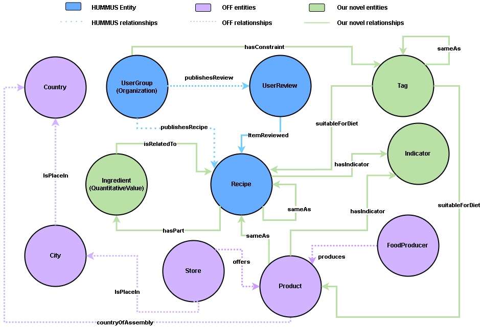

# FoodNexus

This is the official *FoodNexus* repository, developed as part of an applied research initiative in knowledge representation, semantic technologies, and food informatics.

## 📌 Table of Contents
1. [Download](#⬇️-download-the-full-dataset)
2. [Stats](#stats)
3. [Overview](#📘-overview)
4. [Installation and Usage](#📦-installation-and-usage)
5. [Repository Structure](#📂-repository-structure)
6. [Research Objectives](#🎯-research-objectives)
7. [Results](#📊-result)
8. [License](#📜-license)
9. [Authors](#👥-authors)
10. [Acknowledgements](#🙏-acknowledgements)
11. [Contact](#📢-contact)

## ⬇️ Download the full dataset 

Our dataset is fully available for download with multiple threshold values. The link below also provides access to the intermediate files generated during processing.
If you prefer not to download our precomputed resources, you can deterministically reproduce the entire knowledge graph by following the procedure described in the [Installation and Usage](#📦-installation-and-usage) section.

Data: [](https://zenodo.org/records/15710771)

If you want to use the downloaded data, ensure it is placed in the csv_file directory at the root of this repository. If you haven't created this directory yet, do so.

## Stats

Furthermore, the following table details the statistical comparison of our resulting FoodNexus knowledge graph against its constituent data sources, showcasing its scale and richness:

| Data Source        | # Triples   | # Entities  | # Relations | # Attributes | # E. Types | # R. Types | # A. Types |
|--------------------|-------------|-------------|-------------|--------------|------------|------------|------------|
| HUMMUS             | ~53.9M      | ~12.3M      | ~31.1M      | ~22.8M       | 6          | 6          | 9          |
| HUMMUS (inferred)  | ~57.9M      | ~12.3M      | ~35.1M      | ~22.8M       | 6          | 7          | 14         |
| OFF                | ~267.9M     | ~38.5M      | ~160.3M     | ~107.4M      | 7          | 6          | 7          |
| **FoodNexus (Ours)** | **~979.5M** | **~51.0M**  | **~849.9M** | **~130.2M**  | **11**     | **11**     | **15**     |

*Note: The actual implementation of the FoodNexus ontology includes an additional entity, attribute, and three relations for a versioning system. These are not reported in this table, which focuses on entities relevant for recommender systems.*
*E. Types: Entity Types; R. Types: Relation Types; A. Types: Attribute Types.*

---
- **Customizing the Recipe-Product Association Threshold:**
    - The default resource is built with a Recipe-Product association threshold of 0.975. This conservative value helps create a smaller, more robust dataset.
    - For analyses requiring a larger number of high-accuracy associations, a threshold of 0.85 is also effective.
    - You have the flexibility to generate the resource with your preferred threshold by adjusting the relevant parameter in Section 6 of the execution workflow.
 
---

## 📘 Overview



**FoodNexus** aims to:

* Develop one of the most comprehensive food-related ontologies currently available.
* Investigate novel methodologies for **entity linking** and **user attribute extraction** leveraging Large Language Models (LLMs).
* Integrate heterogeneous food knowledge bases (e.g., *OpenFoodFacts*, *HUMMUS*) into a coherent semantic framework.

This project explores the intersection of ontology engineering, natural language processing, and user modeling in the food domain.


To provide context on the comprehensiveness of our FoodNexus dataset compared to other food datasets focused on recommendation, we present the following comparison table:

| Dataset              | Type   | Representation | Access  | Nutrients | Healthiness | Origin Country | Sustainability | Packaging | Interactions | User Attributes |
|----------------------|--------|----------------|----------|------------|--------------|----------------|----------------|------------|---------------|-----------------|
| FoodOn               | DK     | KG             | Public   | ✗          | ✗*           | ✓              | ✗              | ✓          | ✗             | ✗               |
| FoodKG               | UI+DK  | KG             | Public   | ✓          | ✗            | ✗              | ✗              | ✗          | ✓             | ✗               |
| LODHalal             | DK     | KG             | Public   | ✓          | ✗            | ✓              | ✗              | ✗          | ✗             | ✗               |
| HUMMUS               | UI+DK  | Tab            | Public   | ✓          | ✓            | ✗              | ✗              | ✗          | ✓             | ✗               |
| RecSoGood            | UI+DK  | KG             | Private  | ✓          | ✓            | ✗              | ✗              | ✗          | ✓             | ✗               |
| HeASe                | UI+DK  | Tab            | Public   | ✓          | ✓            | ✗              | ✓              | ✗          | ✓             | ✗               |
| GreenRec             | UI     | Tab            | Public   | ✓          | ✓            | ✗              | ✓              | ✗          | ✓             | ✗               |
| OFF (Open Food Facts) | DK     | Tab            | Public   | ✓          | ✓            | ✓              | ✓              | ✓          | ✗             | ✗               |
| **FoodNexus (Ours)** | UI+DK  | KG             | Public   | ✓          | ✓            | ✓              | ✓              | ✓          | ✓             | ✓               |

✓: available ✗: not available or not applicable ✗*: only categorical data (e.g., allergens)

**Legend**:  
- **Type** — UI: User–Item data, DK: Domain Knowledge  
- **Representation** — Tab: Tabular data, KG: Knowledge Graph  
- **Access** — Public or Private availability


This table highlights how FoodNexus aims to integrate a broader range of attributes, including user-related ones, which are crucial for personalized recommendation systems and in-depth analyses.

---

## 📦 Installation and Usage

### 1. Requirements

Install Ollama to host the LLM (o Install Ollama for hosting the LLM).
(The tested Ollama version was December 2024, Newer versions might cause compatibility issues.)

Recommended: create a new clean conda env
```bash
conda create -n foodnexus python=3.10 
conda activate foodnexus
```


Ensure you are using **Python ≥ 3.8**. Then install the dependencies:

```bash
pip install -r requirements.txt
```

### 2. Data Dependencies

To run the scripts successfully, the following external resources are required:

* **HUMMUS**: Preprocessed CSV files (from the `data preprocess` folder in the [HUMMUS repository](https://gitlab.com/felix134/connected-recipe-data-set/-/tree/master/data/hummus_data/preprocessed?ref_type=heads))
* **OFF Ontology**: The OpenFoodFacts ontology, available from the [OFF Wiki](https://world.openfoodfacts.org/data) in csv format. (please rename the file to off.csv to use it with this repository)

Place these files in a new folder named `csv_file` at the root of this repository.


### 3. Execution Workflow

This workflow outlines the steps to reproduce the FoodNexus ontology, from initial data setup to the final merged knowledge graph. Ensure you have completed the steps in "1. Requirements" and "2. Data Dependencies" before proceeding.

1.  **Initial Data Setup:**
    *   Download the required datasets (HUMMUS preprocessed CSVs, OpenFoodFacts CSV) from their official sources, as detailed in the "Data Dependencies" section.
    *   Place all downloaded CSV files into the `csv_file/` directory at the root of this repository and rename the Open Food Facts file to "off.csv".

2.  **Environment and LLM Setup:**
    *   Ensure you have created a Python virtual environment (e.g., using `venv` or `conda`) and installed all dependencies by running `pip install -r requirements.txt` within that environment.
    *   Download and install [Ollama](https://ollama.com/) if you intend to run Large Language Models (LLMs) locally. Follow the official Ollama installation guide.
    *   Create the necessary local LLM models (if using Ollama) by executing the `llm_creation.py` script or the associated Jupyter notebook located in the `analisys_and_file_creation_file/` directory. This step configures the specific LLMs used for inference tasks.

3.  **Core Data Processing and File Generation:**
    *   Execute the `file_creation_jupyter.ipynb` notebook, located in the `analisys_and_file_creation_file/` directory, to perform initial data processing and generate **necessary** intermediate needed files.

4.  **Dataset Normalization:**
    *   Run the normalization scripts in `normalization_pipeline_file` to standardize recipe data from different sources (if you encounter errors run the first cell of pipeline_jupyter.ipynb to install the nltk components):
        *   `python fkg_normalize.py`
        *   `python normalize_hummus.py`
        *   `python off_translate.py`
        *   `python off_normalize.py`

        These scripts will produce normalized recipe datasets.


5.  **LLM-based Information Inference:**
    *   Execute the following scripts in `attribute_extraction_file` to infer additional information (e.g., user attributes, enhanced descriptions) using the configured LLMs:
        *   `python infere_info_from_description.py`
        *   `python infere_info_from_review.py`

6.  **Entity Linking Preparation and Execution:**
    *   **Recipe List Generation:** Execute the *last cell* in the `entity_linking_jupyter.ipynb` notebook, found within the `entity_linking_file/` directory. This step creates a consolidated list of recipes from all datasets, essential for the subsequent BERT-based merging process.
    *   **Embedding Creation:** Generate embeddings for recipe names, which are crucial for similarity-based linking. Execute the following scripts:
        *   `python create_embedding_foodkg.py`
        *   `python create_embedding_hummus.py`
        *   `python create_embedding_off.py`
    *   **Linking Execution:** Perform the entity linking between datasets by running (folder `entity_linking_file`):
        *   `python link_off_hum.py`
        *   `python link_off_foodkg.py`
        *   `python link_hum_hum.py` 
    *   **Threshold Filtering:** Use the `filter_association_by_threshold.ipynb` notebook in `entity_linking_file/`. This allows you to refine the linking results (e.g., by setting a similarity threshold of 0.975). The default threshold is 0.975 to make the resource slimmer and more robust, but all values over 0.85 provide significant relations

7.  **RDF Graph Generation:**
    *   Convert the processed and linked data into RDF triples. Execute the following scripts, found in the `create_rdf_file/` directory:
        *   `python hummus_to_rdf_not_infered.py`
        *   `python hummus_to_rdf.py`
        *   `python off_to_rdf.py`
        *   `python merge_hum_hum_ontology_to_rdf.py`
        *   `python merge_off_fkg_ontology_to_rdf.py`
        *   `python merge_off_hum_ontology_to_rdf.py`


8.  **Final Ontology Merging:**
    *   Execute the `merge_ontology.py` script located in the root directory to combine all generated RDF graphs into the final, unified **FoodNexus** ontology.

## 📂 Repository Structure

```
FoodNexus/
├── analisys_and_file_creation_file/  # Scripts and notebooks for data analysis and RDF prep
├── attribute_extraction_file/        # Attribute extraction logic from user
├── config_file/                      # Configuration for preprocessing and unit normalization
├── create_rdf_file/                  # Scripts to generate RDF triples from processed data
├── csv_file/                         # All non-script file
├── entity_linking_file/              # Scripts for entity linking and embedding generation
├── extra_script_for_hopwise/         # Script to analyze the dataset to apply to the Hopwise repository
├── images/                           # Images used in the README file
├── llm_model_file/                   # Prompt templates for LLMs
├── normalization_pipeline_file/      # Pipeline for normalization of attributes and ingredients
├── ollama_server_file/               # File for using ollama for a long period of time
├── ontology_statistic/               # Ontology evaluation and statistics scripts
├── view_onthology_file/              # Visualization tools for ontologies
├── main.py                           # Main script
├── merge_ontology.py                 # Main script for ontology merging
├── pipeline_jupyter.ipynb            # Notebook for calculate cohen coefficient
├── requirements.txt                  # Python dependencies
└── README.md                         # Project documentation
```

## 🎯 Research Objectives

This project investigates:

* The effectiveness of LLMs for ontology population and schema alignment.
* Automated semantic enrichment from food-related databases.
* Personalized food knowledge graphs through user-driven attribute inference.

The outcomes are relevant for personalized nutrition, semantic search, and knowledge graph completion in the food domain.

# 📊 Result
We trained several recommendation models on the Hummus recipe dataset using the [hopwise](https://github.com/tail-unica/hopwise) library, specifically adopting the branch _24-add-support-for-user-side-kg-and-testing_ at the commit version _b209570f432a2accf763aaa7f98959c89c329283_, which supports the usage of KGs with user-side triples. Subsequently, we evaluated the quality of the recommended recipes by analyzing their nutritional statistics derived from Open Food Facts (OFF) data.

The following models were employed:

- **Pop**: is a non-personalized baseline that recommends items based on their overall popularity, serving as a lower bound for personalized recommendation systems.

- **BPR**: is a pairwise learning-to-rank framework that optimizes models such as matrix factorization for personalized ranking. It maximizes the prediction that observed interactions are ranked higher than unobserved ones, typically trained on implicit feedback using stochastic gradient descent.

- **NeuMF**: is a neural network-based model that combines generalized matrix factorization with a multi-layer perceptron to learn complex user-item interactions from implicit feedback, enabling non-linear collaborative filtering.

- **LightGCN**: simplifies graph convolutional collaborative filtering by removing feature transformation and nonlinear activation, relying solely on neighborhood aggregation to refine user and item embeddings across layers.

- **KGAT**: integrates knowledge graph semantics by extending graph attention networks, propagating relation-specific messages, and learning attention scores for each edge type. The model performs recommendation and KG embedding separately, aligning item representations through shared embeddings and dot product inference.

- **KTUP**: jointly optimizes recommendation and knowledge graph completion using translation-based embedding models. It represents user preferences as relation vectors in a translational framework (i.e., user + preference ≈ item), inspired by models such as TransE and TransH. The model simultaneously learns knowledge graph embeddings to enhance recommendation via shared latent representations.

- **MKR**: employs a multi-task learning framework where recommendation and KG embedding tasks learn shared latent features. Its core Cross\&compress units enable bi-directional knowledge transfer by modeling high-order feature interactions, primarily between items in the recommendation task and entities in the knowledge graph, adaptively learning cross-task relevance.

---

## Model Modifications for User Representation in Knowledge Graphs

For some models (specifically KGAT, KTUP, and MKR), custom variants were developed to explicitly incorporate users as entities within the knowledge graph. This allows user preferences and behaviors to be directly modeled alongside item and attribute information in the KG. The figure below illustrates the general approach to these modifications:


---

## Fine-Tuning and Filtering

Each model underwent a rigorous fine-tuning process. This involved a grid search methodology to identify the optimal set of hyperparameters. Additionally, a data filtering step was applied to remove users and items with a low number of interactions, with the specific interaction count thresholds also determined via grid search.

### Interaction Filtering Thresholds

The range of interaction count thresholds explored during grid search for filtering entities (users/items) was:
*   `user_inter_num_interval`: *[1, 2, 3, 4, 5, 7, 10, 15, 20, 25, 30]*
*   `item_inter_num_interval`: *[1, 2, 3, 4, 5, 7, 10, 15, 20, 25, 30]*

best param:
* user_inter_num_interval: "[5,inf)"
* item_inter_num_interval: "[5,inf)"

### Interaction Filtering Thresholds for triples

The range of interaction count thresholds explored during grid search for filtering triples was:
*   `entity_kg_num_interval`: *[1, 2, 3, 4, 5, 7, 10, 15, 20, 25, 30]*
*   `user_entity_kg_num_interval`: *[1, 2, 3, 4, 5, 7, 10, 15, 20, 25, 30]*

best param:
* kg_reverse_r: False
* entity_kg_num_interval: "[30,inf)"
* relation_kg_num_interval: "[1,inf)"
* user_entity_kg_num_interval: "[5,inf)"


### Hyperparameter Tuning Ranges

The hyperparameter ranges explored for each model during the grid search process were as follows:

- **BPR**:
    - `embedding_size`: `[32, 64, 128, 256]`
    - `learning_rate`: `[0.01, 0.001, 0.0001]`

best param:
embedding_size: 256
lerning_rate: 0.0001


- **LightGCN**:
    - `embedding_size`: `[64, 128]`
    - `learning_rate`: `[0.01, 0.001, 0.0001]`
    - `n_layers`: `[1, 2, 3]`
    - `reg_weight`: `[1e-05, 1e-03]`

best param:
embedding_size': 128
learning_rate: 0.01
n_layers: 2
reg_weight: 1e-05


- **NeuMF**:
    - `mf_embedding_size`: `[64, 128]`
    - `mlp_train`: `[True, False]`
    - `learning_rate`: `[0.01, 0.001, 0.0001]`
    - `dropout_prob`: `[0.0, 0.1]`
    - `mlp_hidden_size`: `['[64,32,16]', '[32,16,8]']`

best param:
mf_embedding_size: 64
mlp_train: False 
learning_rate: 0.001
dropout_prob: 0.0
mlp_hidden_size: [32,16,8]

- **KGAT**:
    - `embedding_size`: `[64, 128]`
    - `learning_rate`: `[0.01, 0.0001]`
    - `layers`: `['[64,32,16]', '[128,64,32]']`
    - `reg_weight`: `[1e-4, 1e-5]`
    - `mess_dropout`: `[0.1, 0.2]`

best param:
embedding_size: 128
layers: [64,32,16]
mess_dropout: 0.2
reg_weights: 0.0001
lerning_rate: 0.0001


- **KTUP**:
    - `embedding_size`: `[64, 128]`
    - `learning_rate`: `[0.01, 0.001, 0.0001]`
    - `L1_flag`: `[True, False]`
    - `use_st_gumbel`: `[True, False]`
    - `train_rec_step`: `[8, 10]`
    - `train_kg_step`: `[1, 2, 3]`

best param:
train_rec_step: 10
train_kg_step: 1
embedding_size: 128
use_st_gumbel: True
L1_flag: False
learning_rate: 0.001

- **MKR**:
    - `embedding_size`: `[64, 128]`
    - `learning_rate`: `[0.01, 0.001, 0.0001]`
    - `low_layers_num`: `[1, 2, 3]`
    - `high_layers_num`: `[1, 2]`
    - `l2_weight`: `[1e-6, 1e-4]`
    - `kg_embedding_size`: `[32, 64]`

best param:
embedding_size: 128
kg_embedding_size: 64
low_layers_num: 3
high_layers_num: 1
kge_interval: 3
learning_rate: 0.001
use_inner_product: True
reg_weight: 1e-06
dropout_prob: 0.0

---


**Recommendation Utility**  
We evaluated multiple recommendation models using **Hit**, **Recall**, and **NDCG** at top-10, top-20, and top-50 cutoffs. As expected, the non-personalized baseline **Pop** performs poorly, highlighting the importance of personalized modeling for food recommendations. Interaction-based models (**BPR**, **NeuMF**, **LightGCN**) improve substantially, with **LightGCN** achieving the highest Hit scores and **KGAT** excelling in Recall and NDCG by leveraging knowledge graph semantics. Among KG-aware variants, **UserMKR** shows consistent improvements, demonstrating that user relations can further enhance recommendation performance when integrated effectively.


Model Performance:

| Model     | Hit@10 | Hit@20 | Hit@50 | Recall@10 | Recall@20 | Recall@50 | NDCG@10 | NDCG@20 | NDCG@50 |
|------------|:------:|:------:|:------:|:----------:|:----------:|:----------:|:--------:|:--------:|:--------:|
| **Pop**        | 0.0035 | 0.0050 | 0.0077 | 0.0008 | 0.0010 | 0.0013 | 0.0008 | 0.0009 | 0.0009 |
| **BPR**        | 0.0474 | 0.0777 | 0.1361 | 0.0136 | 0.0244 | 0.0467 | 0.0102 | 0.0133 | 0.0189 |
| **NeuMF**      | 0.0562 | 0.0886 | 0.1491 | 0.0175 | 0.0276 | 0.0515 | 0.0131 | 0.0160 | 0.0220 |
| **LightGCN**   | **0.0604** | **0.0930** | **0.1558** | 0.0184 | 0.0307 | 0.0557 | 0.0140 | 0.0173 | 0.0235 |
| **MKR**        | 0.0413 | 0.0656 | 0.1126 | 0.0166 | 0.0272 | 0.0477 | 0.0111 | 0.0140 | 0.0188 |
| **KTUP**       | 0.0446 | 0.0737 | 0.1260 | 0.0189 | 0.0315 | 0.0552 | 0.0118 | 0.0154 | 0.0210 |
| **KGAT**       | 0.0580 | 0.0903 | 0.1453 | **0.0231** | **0.0372** | **0.0628** | **0.0152** | **0.0191** | **0.0252** |
| **UserKGAT**   | 0.0187 | 0.0368 | 0.0802 | 0.0084 | 0.0164 | 0.0370 | 0.0046 | 0.0069 | 0.0116 |
| **UserKTUP**   | 0.0388 | 0.0690 | 0.1260 | 0.0154 | 0.0295 | 0.0570 | 0.0093 | 0.0133 | 0.0198 |
| **UserMKR**    | 0.0461 | 0.0744 | 0.1264 | 0.0187 | 0.0319 | 0.0556 | 0.0120 | 0.0157 | 0.0212 |

---


**Nutritional and Contextual Analysis**  
We also analyzed how models influence the distribution of food attributes in recommendations. Most models tend to over-recommend gluten-containing items and plastic-packaged products while under-representing milk or more sustainable items. User-aware approaches generally produce a more balanced allergen and sustainability profile. Nutritionally, models slightly under-represent vitamins, potassium, and certain micronutrients; some models (e.g., **NeuMF**, **UserKGAT**) reduce added sugars, saturated fat, and additives while favoring less processed items. Overall, FoodNexus provides rich semantic grounding that enables more balanced, health-conscious, and contextually-aware recommendations.


---

## 📜 License

This project is licensed under the MIT License. See the [LICENSE](LICENSE) file for details.

## 👥 Authors

* **Giovanni Zedda**

  * [LinkedIn](https://it.linkedin.com/in/giovanni-zedda-99a18231b)
  * [GitHub](https://github.com/0negip)

* **Giacomo Medda**

  * [LinkedIn](https://www.linkedin.com/in/giacomo-medda-4b7047200/)
  * [GitHub](https://github.com/jackmedda)

## 🙏 Acknowledgements

We gratefully acknowledge:

* **OpenFoodFacts** and **HUMMUS** for providing food-related datasets.
* The **rdflib** community for RDF parsing and serialization tools.
* The **University of Cagliari** for academic support and infrastructure.

## 📢 Contact

For questions, feedback, or collaborations, please contact:
📧 [zeddagiovanni4021@gmail.com](mailto:zeddagiovanni4021@gmail.com)
